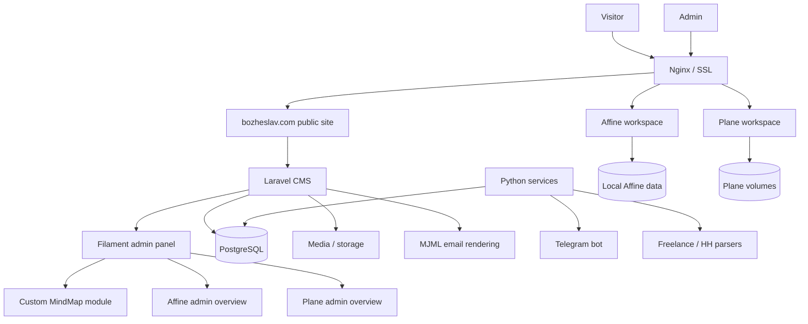

# bozheslav.com — Personal Portfolio, Blog & CMS

> Live: [bozheslav.com](https://bozheslav.com) · Author: Mikhail Ankudinov

Personal portfolio, blog, CMS, and automation services built from scratch and deployed on a self-configured VPS.  
The project separates the public site source, Laravel CMS, Python automation services, self-hosted workspace tools, and infrastructure files into clear system-design layers.


---

## Stack

| Layer | Tech |
|---|---|
| CMS / Application | PHP 8.3, Laravel 12, Filament PHP v3 |
| Admin UI extensions | Filament custom pages/resources, Tiptap editor, Curator media library |
| Frontend source | HTML5, CSS3 (BEM), JavaScript ES6+ |
| Frontend rendering | Blade templates, Laravel routes, Vite assets |
| Email tooling | MJML, SMTP test sending, reusable email templates |
| Automation services | Python 3.12, Telegram bot, freelance parsers, HeadHunter parser |
| Database | PostgreSQL 16 |
| Web server | Nginx 1.24, PHP-FPM 8.3 |
| Infrastructure | Ubuntu 24.04 LTS, Docker/Podman Compose, Certbot |
| Self-hosted tools | Affine, Plane |
| Security | SSH keys, fail2ban, restricted admin routes |

---

## Features

### Frontend

- Semantic HTML, BEM methodology, no CSS frameworks
- Dark / Light theme toggle
- Adaptive layout with mobile-first behavior
- Static source layout kept separately from CMS-rendered Blade templates
- Multilingual public routes with a language switcher controlled separately from admin translations

### CMS

- Blog with Builder blocks: heading, text, code, image, quote, before/after, embedded mind maps
- Previous/next article navigation and random related articles
- Portfolio with demo-project ZIP deployment
- Static pages, media library, SEO fields
- Trash system with restore flow
- Site options: social links, hero buttons, resume upload
- Visit tracking with GeoIP2 / MaxMind analytics
- Server monitoring: RAM, disk, banned IPs, failed login attempts
- Email templates with MJML preview and SMTP test sending
- Separate email media library with folder management and bulk upload
- Custom MindMap resource with an editor and public article rendering
- Admin overview pages for connected Affine and Plane services

### Services

- Telegram freelance bot
- Freelance project parsers
- HeadHunter parser
- PostgreSQL-backed automation data
- Isolated Python virtual environments outside the CMS source tree

### Self-hosted Tools

- Affine workspace with local Docker/Podman Compose configuration and admin integration
- Plane project-management workspace with local Docker/Podman Compose configuration and admin integration
- Runtime data, private keys, and real `.env` files are intentionally excluded from Git

### Infrastructure

- Nginx virtual host for `bozheslav.com`
- Reverse-proxy configs for connected subdomains and self-hosted tools
- Let's Encrypt SSL via Certbot
- Laravel Scheduler via cron
- PostgreSQL backups
- Deployment script for syncing static HTML layouts into Blade views

---

## Project Structure

```text
bozheslav/
├── affine/                 # Affine compose/template files; runtime data ignored
├── cms/                    # Laravel CMS application root
│   ├── app/                # Laravel PHP namespace: models, HTTP, Filament, providers
│   ├── bootstrap/
│   ├── config/
│   ├── database/
│   ├── lang/
│   ├── public/             # Web root for Nginx
│   ├── resources/          # Blade views and frontend source used by Laravel
│   ├── routes/
│   ├── storage/            # Runtime files, media, cache, logs
│   ├── tests/
│   ├── artisan
│   ├── composer.json
│   └── package.json
│
├── bozheslav.com/          # Static HTML/CSS/JS source layout
├── plane/                  # Plane compose/template files; secrets and runtime data ignored
├── services/               # Python bots and parsers
│   ├── freelance_bot/
│   └── hh_parser/
│
├── infrastructure/
│   ├── nginx/              # Nginx site config copy
│   ├── docker/             # Docker-related reverse-proxy configs
│   └── deploy/             # Deployment scripts
│
├── backups/                # Local database backup output, ignored by Git
└── README.md
```

The inner `cms/app` directory is the standard Laravel application namespace and should not be renamed.  
The outer `cms` directory describes the component role in the system: content management, site rendering, admin panel, and application workflows.

---

## System Design



---

## Local Setup

### CMS

```bash
git clone https://github.com/Magbusjap/bozheslav.git
cd bozheslav/cms
cp .env.example .env
composer install
npm install
php artisan key:generate
php artisan migrate
php artisan storage:link
npm run build
php artisan serve
```

### Python Services

Each service is isolated from the Laravel source tree and should use its own virtual environment.

```bash
cd services/freelance_bot
python3.12 -m venv .venv
source .venv/bin/activate
```

Install the Python packages required by each service and create local service `.env` files from the variables required by the bot/parser code. Real service credentials are not tracked by Git.

### Optional Self-hosted Tools

Affine and Plane are optional local/self-hosted integrations. Commit only compose files and `.env.example` templates; keep real `.env` files, private keys, uploaded files, and database data local.

```bash
cd affine
cp .env.example .env
docker compose -f compose.yml up -d
```

```bash
cd plane
cp .env.example .env
docker compose up -d
```

---

## Deploy

Deployment uses `infrastructure/deploy/deploy.sh`.

The script:

- pulls the latest project state when Git is enabled;
- copies source HTML files from `bozheslav.com/` into Blade templates under `cms/resources/views/`;
- clears Laravel views and refreshes route cache.

Production Nginx serves the Laravel public directory:

```nginx
root /var/www/bozheslav/cms/public;
```

Laravel Scheduler runs from:

```bash
cd /var/www/bozheslav/cms && php artisan schedule:run
```

---

## License

Personal project. Not for commercial reuse.

---

 [bozheslav.com](https://bozheslav.com)
